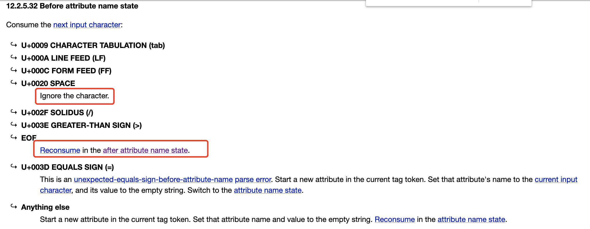

# 学习笔记

## HTML解析
- 第一步: HTML parse模块拆分
  - 为了方便文件管理，我们把parser单独拆到文件中
  - parser接受HTML文本作为参数，返回一颗DOM树
  - https://html.spec.whatwg.org/  
    - 12.2.5 Tokenization  这一章就是HTML的词法
- 第二步：用FSM实现HTML分析
  - 使用有限状态机（FSM）来实现HTML的分析
  - 在HTML标准中，已经规定了HTML的状态
  - Toy-Browser只挑选其中一部分状态，完成一个最简版本
- 第三步：解析标签
  - 使用有限状态机（FSM）来实现HTML的分析
  - 在HTML标准中，已经规定了HTML的状态
- 第四步：创建元素
  - 在状态机中，除了状态迁移，还会加入业务逻辑
  - 在标签结束状态提交标签token
- 第五步：处理属性
  - 属性值分为单引号、双引号、无引号三种写法，因此需要较多状态处理
  - 处理属性的方式跟标签类似
  - 属性结束时，吧属性加到标签Token上
- 第六步：用token构建DOM树
  - 从标签构建DOM树的基本技巧是使用栈
  - 遇到开始标签时创建元素并入栈，遇到结束标签时出栈
  - 自封闭节点可视为如战后立刻出栈
  - 任何元素的父元素是它入栈前的栈顶
- 第七步：将文本节点加到DOM树中
  - 文本节点与自封闭标签处理类似
  - 多个文本节点需要合并


## CSS计算
- 第一步：收集CSS规则
  - 遇到style标签时，把CSS规则保存起来
  - 调用CSS Parser 来分析CSS规则  
  - 需要仔细研究此库分析CSS规则的格式
- 第二步：添加调用
  - 当我们创建一个元素后，立即计算CSS
  - 理论上，当我们分析一个元素时，所有CSS规则已经收集完毕
  - 在真实浏览器中，可能遇到写在body的style标签，需要重新CSS计算的情况
- 第三步：获取父元素序列
  - 在computeCSS函数中，我们必须知道元素的所有父元素才能判断元素与规则是否匹配
  - 从上一步骤的stack，可以获取本元素所有的父元素
  - 因为首先获取的是“当前元素”，所以我们获得和计算父元素匹配的顺序是从内向外
- 第四步：选择器与元素匹配
  - 选择器跟当前元素的父元素排列顺序是一致的，都是从内向外排列的
  - 复杂选择器拆成针对单个元素的选择器，用循环匹配父元素队列
- 第五步：计算选择器与元素匹配
  - 根据选择器的类型和元素属性，计算是否与当前元素匹配
  - 这里仅仅实现了三种基本选择器，实际的浏览器中要处理复合选择器
- 第六步：生成computed属性
  - 一旦选择匹配，就应用选择器到元素上，形成computedStyle
- 第七步：specificity的计算逻辑
  - CSS规则根据specificity和后来有限规则覆盖
  - specificity是一个四元组，越左边权重越高
  - 一个CSS规则的specificity根据包含的简单选择器相加而成
  - 四元组规则：inline > id > class > tag

## 总结
  本周主要学习HTML parse和 CSS computing

### HTML parse部分
- 处理属性部分，可以参考[html.spec.whatwg.org](https://html.spec.whatwg.org/)的文档，可以了解一些编码的方法，比如
```
    function beforeAttributeName(c) {
    if (c.match(/^[\t\n\f ]$/)) {
        // 4种有效的空白符结束： tab符，换行符，禁止符和空格 <html prop
        return beforeAttributeName;
    } else if (c == "/" || c == ">" || c == EOF) {
        // <html> 普通的开始标签，所以需要结束掉这个标签，开始回到data状态解析下一个标签，
        return afterAttributeName(c);
    } else if (c == "=") {
    } else {
        currentAttribute = {
        name: "",
        value: "",
        };
        console.log("currentAttribute", currentAttribute);
        return attributeName(c);
    }
    }
```
可以找到对应的 [12.2.5.32 Before attribute name state](https://html.spec.whatwg.org/multipage/parsing.html#before-attribute-name-state)

每一个条件可以认为对应于一个if else语句，其中\t是CHARACTER TABULATION (tab)，\n是LINE FEED (LF)，\f是FORM FEED (FF)，空格是U+0020 SPACE。
- 课程中一共处理了13种状态：

|ToyBrowser中的状态   | 对应的html.spec.whatwg.org中的状态  |
|---|---|
|data   |[12.2.5.1 Data state](https://html.spec.whatwg.org/multipage/parsing.html#data-state)   |
|tagOpen   | [12.2.5.6 Tag open state](https://html.spec.whatwg.org/multipage/parsing.html#tag-open-state)  |
|endTagOpen   |[12.2.5.7 End tag open state](https://html.spec.whatwg.org/multipage/parsing.html#end-tag-open-state)   |
|tagName   | [12.2.5.8 Tag name state](https://html.spec.whatwg.org/multipage/parsing.html#tag-name-state)|
|beforeAttributeName | [12.2.5.32 Before attribute name state](https://html.spec.whatwg.org/multipage/parsing.html#before-attribute-name-state)|
|afterAttributeName  | [12.2.5.34 After attribute name state](https://html.spec.whatwg.org/multipage/parsing.html#after-attribute-name-state) |
|attributeName       | [12.2.5.33 Attribute name state](https://html.spec.whatwg.org/multipage/parsing.html#attribute-name-state) |
|beforeAttributeValue| [12.2.5.35 Before attribute value state](https://html.spec.whatwg.org/multipage/parsing.html#before-attribute-value-state)|
|doubleQuotedAttributeValue | [12.2.5.36 Attribute value (double-quoted) state](https://html.spec.whatwg.org/multipage/parsing.html#attribute-value-(double-quoted)-state) |
|singleQuotedAttributeValue | [12.2.5.37 Attribute value (single-quoted) state](https://html.spec.whatwg.org/multipage/parsing.html#attribute-value-(single-quoted)-state)|
|afterQuotedAttributeValue | [12.2.5.39 After attribute value (quoted) state](https://html.spec.whatwg.org/multipage/parsing.html#after-attribute-value-(quoted)-state)|
|unquotedAttributeValue | [12.2.5.38 Attribute value (unquoted) state](https://html.spec.whatwg.org/multipage/parsing.html#attribute-value-(unquoted)-state)|
|selfClosingStartTag | [12.2.5.40 Self-closing start tag state](https://html.spec.whatwg.org/multipage/parsing.html#self-closing-start-tag-state)|

### CSS computing部分
- 收集CSS规则，首先安装CSS包来解析CSS rules，npm install css
- CSS Computing就是指将CSS规则添加到DOM树中。 需要对CSS进行词法分析和语法分析，其中的编译原理知识略过，改用npm install css，其作用为将css转为AST（抽象语法树）。
- 一条css rule主要由selectors，declarations组成。selectors是一个list：body div img, #myid会通过逗号分隔，变成两个selectors。
- CSS设计里面的潜规则：尽量保证大部分的选择器在进入startTag的时候就会被判断。
- 获取父元素序列来实现[descendant combinator](https://www.w3.org/TR/selectors/#descendant-combinators)。
- specificity的计算
  - specificity是专指程度（可以理解为priority），优先级：inline > id > class > tag
  - 比如复杂选择器div div #id的specificity是[0, 1, 0, 2]；另有一个复杂选择器div #my #id的specificity是[0, 2, 0, 1]。我们可以比较第二位第一个是1，第二个是2，所以如果这两个选择器有相同属性的话，后面会覆盖上面的，这就是优先级高的会覆盖优先级低的。


