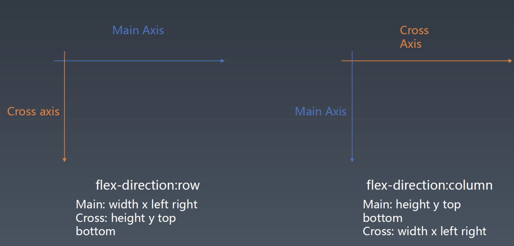
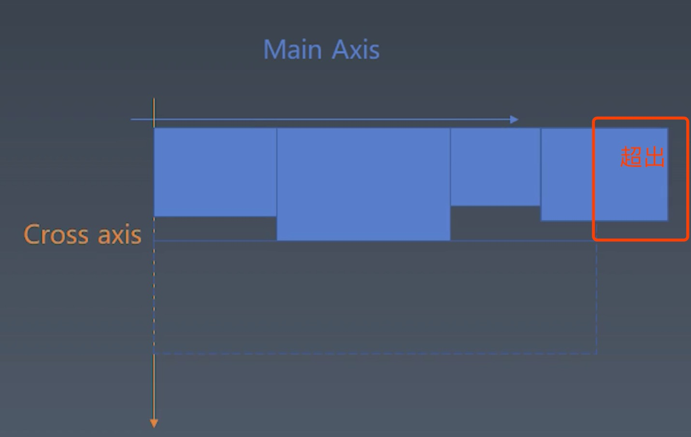
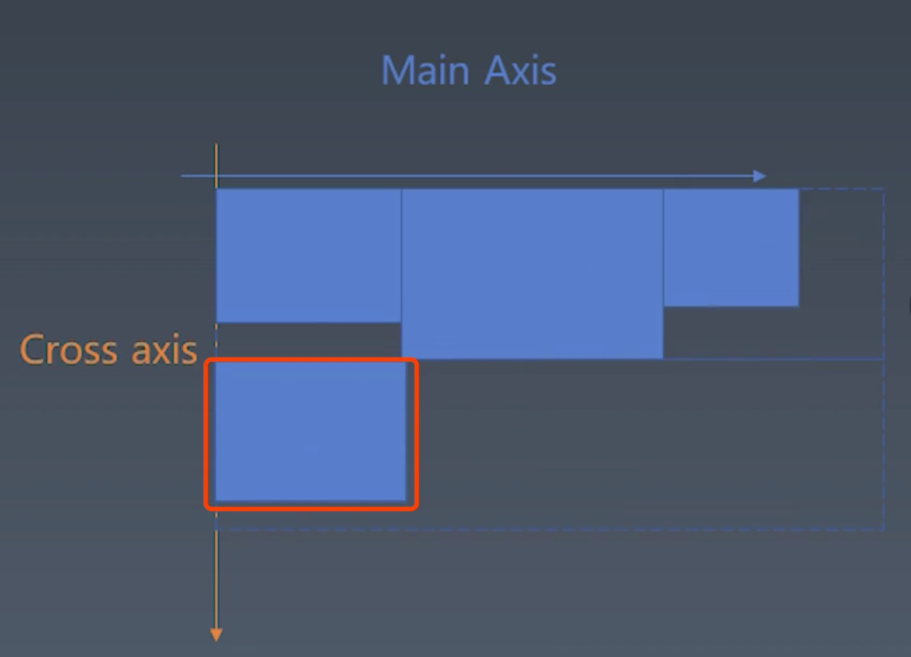

<!--
 * @Author: your name
 * @Date: 2020-05-16 23:42:46
 * @LastEditTime: 2020-08-22 23:55:31
 * @LastEditors: Please set LastEditors
 * @Description: In User Settings Edit
 * @FilePath: /Frontend-03-Template/week04/NOTE.md
-->
## 学习笔记

### 排版

- 根据浏览器属性进行排版
- 渲染是通过npm包images库处理的
- flex排版相关概念

  - flex排版分主轴和交叉轴，元素排列会根据主轴方向排列，交叉轴与主轴垂直
  - 主轴相关的属性就是width、left、right
  - 交叉轴相关的属性就是height、top、bottom
  - flex容器相关属性
  
  |flex属性   | 概念  |
  |---|---|
  |flex-direction | 决定主轴的方向(即项目的排列方向) |
  |flex-wrap | 决定容器内项目是否可换行 |
  |flex-flow | flex-direction 和 flex-wrap 的简写形式 |
  |justify-content | 定义了项目在主轴的对齐方式 |
  |align-items | 定义了项目在交叉轴上的对齐方式 |
  |align-content | 定义了多根轴线的对齐方式，如果项目只有一根轴线，那么该属性将不起作用 |

- 对style进行预处理
   - 用px标识对属性变成纯粹的数字
   - 纯数字转一下类型
 ```
 function getStyle(element) {
  if (!element.style) {
    element.style = {};
  }

  if (Object.keys(element.style).length > 0) {
    return element.style;
  }

  for (let prop in element.computedStyle) {
    element.style[prop] = element.computedStyle[prop].value;

    if (element.style[prop].toString().match(/px$/)) {
      element.style[prop] = parseInt(element.style[prop]);
    }
    if (element.style[prop].toString().match(/^[0-9\.]+$/)) {
      element.style[prop] = parseInt(element.style[prop]);
    }
    if (prop.indexOf("-") !== -1) {
      let list = prop.split("-");
      let camelProp = list[0];
      for (let i = 1; i < list.length; i++) {
        camelProp = camelProp + list[i][0].toUpperCase() + list[i].slice(1);
      }
      element.style[camelProp] = element.style[prop];
    }
  }
  return element.style;
}
 ```
- 主轴、交叉轴属性的预处理: 
  - 过滤掉一些元素
  - 根据order属性做一下排序
  - 设置flex相关属性的默认值
```
function layout(element) {
  if (!element.computedStyle) {
    return;
  }

  let elementStyle = getStyle(element);

  if (elementStyle.display !== "flex") {
    return;
  }

  let items = element.children.filter(e => e.type === "element");

  items.sort((a, b) => {
    return (a.style.order || 0) - (b.style.order || 0);
  });

  // 取出style属性，处理主轴和交叉轴
  let style = elementStyle;

  ["width", "height"].forEach(size => {
    if (style[size] === "auto" || style[size] === "") {
      style[size] = null;
    }
  });

  if (!style.flexDirection || style.flexDirection === "auto") {
    style.flexDirection = "row";
  }
  if (!style.alignItems || style.alignItems === "auto") {
    style.alignItems = "stretch";
  }
  if (!style.justifyContent || style.justifyContent === "auto") {
    style.justifyContent = "flex-start";
  }
  if (!style.flexWrap || style.flexWrap === "auto") {
    style.flexWrap = "nowrap";
  }
  if (!style.alignContent || style.alignContent === "auto") {
    style.alignContent = "stretch";
  }

}
```
- 设置计算flex排版需要的属性的初始值
```
function layout(element) {
  ...
  let mainSize, // 主轴尺寸 width height
    mainStart, // 主轴开始位置 left right top bottom
    mainEnd, // 主轴结束位置 left right top bottom
    mainSign, // 主轴符号位 +1 -1
    mainBase, // 主轴开始位置值 0 style.width style.height
    crossSize, // 交叉轴尺寸 width height
    crossStart, // 交叉轴开始位置 left right top bottom
    crossEnd, // 交叉轴结束位置 left right top bottom
    crossSign, // 交叉轴符号位 +1 -1
    crossBase; // 交叉轴开始位置值 0 style.width style.height

  if (style.flexDirection === "row") {
    mainSize = "width";
    mainStart = "left";
    mainEnd = "right";
    mainSign = +1;
    mainBase = 0;

    crossSize = "height";
    crossStart = "top";
    crossEnd = "bottom";
  }
  if (style.flexDirection === "row-reverse") {
    mainSize = "width";
    mainStart = "right";
    mainEnd = "left";
    mainSign = -1;
    mainBase = style.width;

    crossSize = "height";
    crossStart = "top";
    crossEnd = "bottom";
  }
  if (style.flexDirection === "column") {
    mainSize = "height";
    mainStart = "top";
    mainEnd = "bottom";
    mainSign = +1;
    mainBase = 0;

    crossSize = "width";
    crossStart = "left";
    crossEnd = "right";
  }
  if (style.flexDirection === "column-reverse") {
    mainSize = "height";
    mainStart = "bottom";
    mainEnd = "top";
    mainSign = -1;
    mainBase = style.height;

    crossSize = "width";
    crossStart = "left";
    crossEnd = "right";
  }

  if (style.flexWrap === "wrap-reverse") {
    let temp = crossStart;
    crossStart = crossEnd;
    crossEnd = temp;
    crossSign = -1;
  } else {
    crossBase = 0;
    crossSign = 1;
  }
  ...
}
```
- 收集元素进行
  - 收集元素进行
  - 若设置了no-wrap，则强行分配进第一行
> 当我们来一个元素(flex item)的时候，先往当前行放，如果超出了，会另起一行，以此类推

 

> 如果父元素没有设置主轴尺寸，比如主轴是width属性，那么父元素是没有width的，那么就会进入一个AutoMainSize模式(父元素没有设置主轴尺寸，所以由主轴撑开，这种情况下，它的尺寸无论如何也不会超)
```
let isAutoMainSize = false;
  // 父元素没有设置主轴尺寸的时候，由子元素的mainSize相加
  if (!style[mainSize]) {
    style[mainSize] = 0;
    // 把所有的子元素的mainSize加起来就是主轴的size
    for (let i = 0; i < items.length; i++) {
      let itemStyle = getStyle(items[i]);
      if (itemStyle[mainSize] !== null && itemStyle[mainSize] !== void 0) {
        style[mainSize] += itemStyle[mainSize];
      }
    }
    isAutoMainSize = true;
  }

```
> 计算入行
```
// 把元素收集进行
  let flexLine = [];
  let flexLines = [flexLine];

  let mainSpace = style[mainSize]; // 剩余空间 = 元素的父元素的mainSize，即主轴尺寸
  let crossSpace = 0;

  for (let i = 0; i < items.length; i++) {
    let item = items[i];
    let itemStyle = getStyle(item);

    if (itemStyle[mainSize] === null) {
      itemStyle[mainSize] = 0;
    }

    // 只要当前元素由flex就认为是可伸缩的，因为可伸缩，所以肯定可以放进行里
    if (itemStyle.flex) {
      flexLine.push(item);
    } else if (style.flexWrap === "nowrap" || isAutoMainSize) {
      // 如果是autoMainSize，每个元素直接放进去即可
      mainSpace -= itemStyle[mainSize];
      if (itemStyle[crossSize] !== null && itemStyle[crossSize] !== void 0) {
        // 最大的交叉轴尺寸
        crossSpace = Math.max(crossSpace, itemStyle[crossSize]);
      }
      flexLine.push(item);
    } else {
      // style.flexWrap === 'wrap'
      if (itemStyle[mainSize] > style[mainSize]) {
        itemStyle[mainSize] = style[mainSize];
      }
      if (mainSpace < itemStyle[mainSize]) {
        // mainSpace、crossSpace保存在旧的一行里
        // 换行逻辑
        // 如果元素比父元素尺寸大，需要把把父元素尺寸赋值给当前元素的尺寸if (itemStyle[mainSize] > style[mainSize]) {
        flexLine.mainSpace = mainSpace;
        flexLine.crossSpace = crossSpace;
        flexLine = [item];
        flexLines.push(flexLine);
        // 重置mainSpace和crossSpace
        mainSpace = style[mainSize];
        crossSpace = 0;
      } else {
        flexLine.push(item);
      }
      // mainSpace计算：计算主轴和交叉轴的尺寸
      if (itemStyle[crossSize] !== null && itemStyle[crossSize] !== void 0) {
        crossSpace = Math.max(crossSpace, itemStyle[crossSize]);
      }
      mainSpace -= itemStyle[mainSize];
    }
  }
  flexLine.mainSpace = mainSpace;
```

- 计算主轴方向
  - 找出所有Flex元素
  - 把主轴方向的剩余尺寸按比例分配给这些元素
  - 若剩余空间为负数，所有flex元素为0，等比压缩剩余元素
- 计算交叉轴方向
  - 根据每一行最大元素尺寸计算行高
  - 根据行高flex-align和item-align，确定元素具体位置

### 渲染

- 绘制单个元素
  - 绘制需要一个图形环境
  - 采用npm包images画图 npm install images
  - 绘制在一个viewport上进行
  ```
    const images = require("images");
    
    ...
    let viewport = images(800, 600);
  ```
  - 与绘制相关的属性：background-color、border、background-image等
  
- 绘制DOM树
  - 递归调用自元素等绘制方法完成DOM树等绘制
  - 忽略一些不需要绘制的节点
  - 实际浏览器中，文字绘制是难点，需要依赖字体库
  - 实际浏览器中，还会对一些图层做compositing

```
const images = require("images");

function render(viewport, element) {
  if (element.style) {
    let img = images(element.style.width, element.style.height);

    if (element.style["background-color"]) {
      let color = element.style["background-color"] || "rgb(0, 0, 0)";
      color = color.replace(/\s+/g, "");
      color.match(/rgb\((\d+),(\d+),(\d+)\)/);
      img.fill(Number(RegExp.$1), Number(RegExp.$2), Number(RegExp.$3));
      viewport.draw(img, element.style.left || 0, element.style.top || 0);
    }
  }

// 采用递归绘制dom
  if (element.children) {
    for (let child of element.children) {
      render(viewport, child);
    }
  }
}

module.exports = render;

```


  

