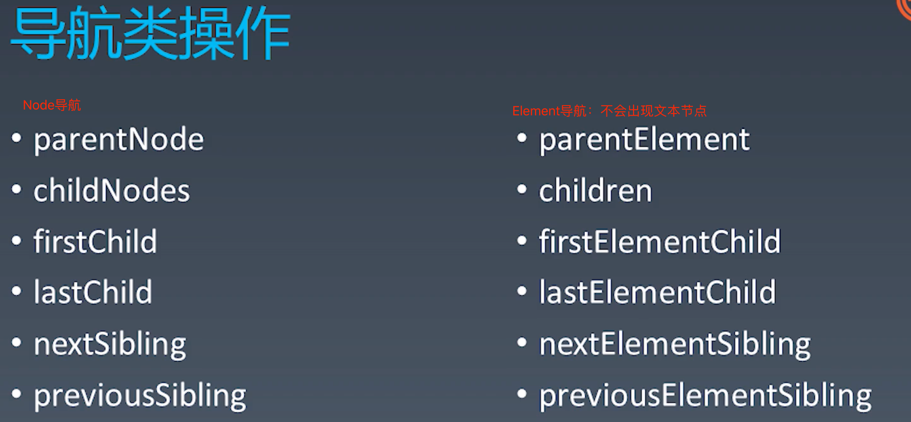
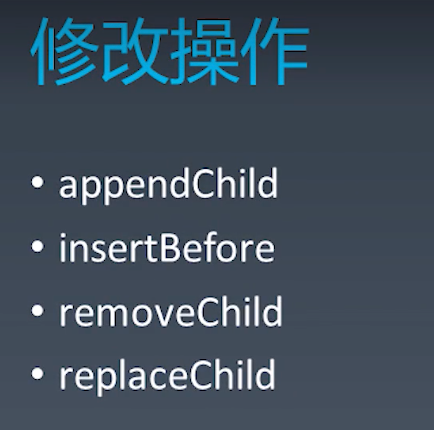
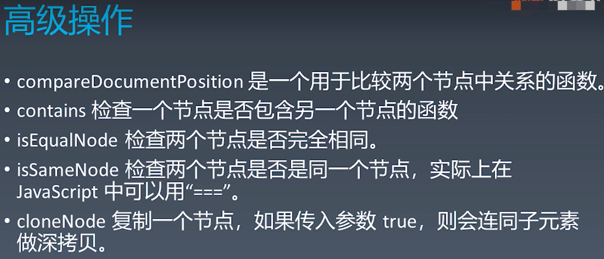
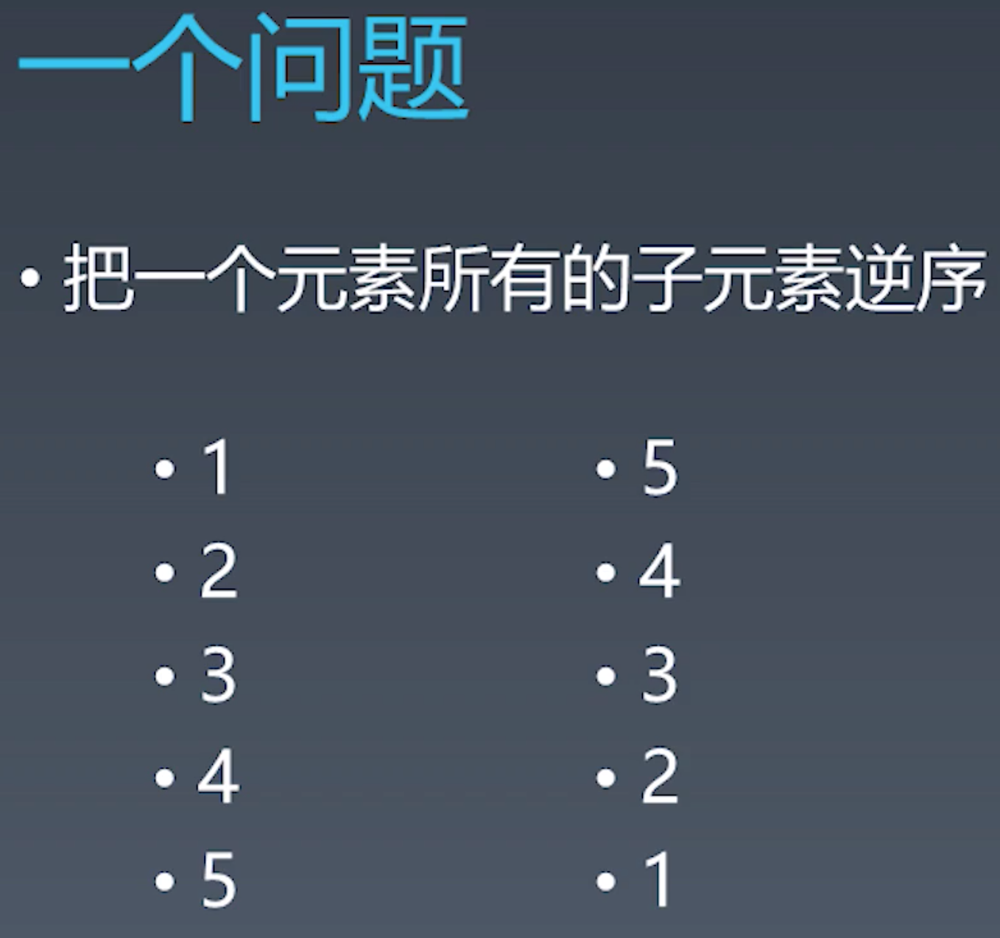
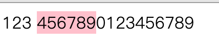
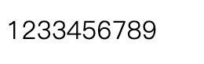
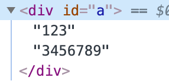

<!--
 * @description: description
 * @author: liuyun03
 * @Date: 2020-07-23 16:30:46
 * @LastEditors: liuyun03
 * @LastEditTime: 2020-09-10 11:24:10
-->
# 笔记

## HTML的定义：XML与SGM
1. DTD
   1. DTD是SGML规定的定义它的子集的一种文档格式。HTML最早设计出来是一个SGML子集
   2. DTD: http://www.w3.org/TR/xhtml1/DTD/xhtml1-strict.dtd
   3. namespace: http://www.w3.org/1999/xhtml 
   4. W3C标准提出任何人不得在实现浏览器的时候去访问DTD
2. 实体定义：&符后边跟一系列的字符
   1. HTMLlat1:  PUBLIC "-//W3C//ENTITIES Latin 1 for XHTML//EN" "http://www.w3.org/TR/xhtml1/DTD/xhtml-lat1.ent" in XHTML 1.0;
   2. HTMLsymbol: PUBLIC "-//W3C//ENTITIES Symbols for XHTML//EN" "http://www.w3.org/TR/xhtml1/DTD/xhtml-symbol.ent" in XHTML 1.0;
   3. HTMLspecial: PUBLIC "-//W3C//ENTITIES Special for XHTML//EN" "http://www.w3.org/TR/xhtml1/DTD/xhtml-special.ent" in XHTML 1.0.
   4. **注意：nbsp，早期用来代替空格，但是nbsp来代替空格问题很多，因为nbsp叫no-break space(意思是它在连接之后并不把单词分开而是把两个词连成一个词，导致排版时候出现分词问题)。nbsp的Unicode码是00A0。推荐使用css的white-space属性控制空格。"标准"栏指出该字符实体首次定义在哪个版本的HTML DTD中。HTML 4.01没有增加任何新的字符实体
   
3. [HTML中的字符实体引用](https://www.wikiwand.com/zh/XML%E4%B8%8EHTML%E5%AD%97%E7%AC%A6%E5%AE%9E%E4%BD%93%E5%BC%95%E7%94%A8%E5%88%97%E8%A1%A8#/XHTML%E4%B8%AD%E7%9A%84%E7%89%B9%E6%AE%8A%E5%AD%97%E7%AC%A6%E7%9A%84%E5%AE%9E%E4%BD%93%E5%BC%95%E7%94%A8)
4. XML namespace
   1. url对于namespace是可有可无的设施
   2. 每个url中的namespace都代表一个唯一的一种语言
      1. HTML的namespace
      2. HTML namespace
      3. XHTML namespace
      4. MathML namespace
      5. SVG namespace

## HTML的标签语义

## HTML语法
1. 合法元素
   1. Element: ```<tagname>...</tagname>```
   2. Text: text
   3. Comment: <!-- comments -->
   4. DocumentType: ```<!Doctype html>```
   5. ProcessingInstruction: ```<?a 1?>```
   6. ```CDATA: <![CDATA[ ]]>```  文本的另一种语法的表达
2. 字符引用
   1. &#161;
   2. &amp;
   3. &lt;
   4. &quot;

## 浏览器API | 事件API https://developer.mozilla.org/en-US/docs/Web/API/EventTarget/addEventListener 
1. target.addEventListener(type, listener [, options]);
   1. options
      1. passive: 设置为true时，表示 listener 永远不会调用 preventDefault()。如果 listener 仍然调用了这个函数，客户端将会忽略它并抛出一个控制台警告。表示这个事件是否是一个不会产生副作用的事件，单纯的想监听这个事件，例如当我们用onScroll这种高频次触发的事件时候，传入passive参数，可以提升性能。但是如果想在事件发生的时候阻止这个事件的某些默认行为的话，一定要把passive写成true。移动端，passive默认设置成了false, 但是，这引入了处理某些触摸事件（以及其他）的事件监听器在尝试处理滚动时阻止浏览器的主线程的可能性，从而导致滚动处理期间性能可能大大降低。为防止出现此问题，某些浏览器（特别是Chrome和Firefox）已将touchstart和touchmove事件的passive选项的默认值更改为true文档级节点 Window，Document和Document.body。这可以防止调用事件监听器，因此在用户滚动时无法阻止页面呈现。
      2. capture:   事件的冒泡或捕获跟监听没有关系，  它在任何一次事件触发的过程中 ，冒泡和捕获都会发生，并不是不加addEventListener就代表冒泡和捕获不糊发生，冒泡和捕获是浏览器自己去处理事件的一套机制，不管监听不监听，过程都在。

## 浏览器API | DOM API
1. 节点部分：所有DOM树上能挂着的都统一继承自Node类
   1. Element：元素型节点，跟标签相对应
   2. HTMLElement
      1. HTMLAnchorElement
      2. a标签
      3. HTMLAppletElement
      4. HTMLAreaElement
      5. HTMLAudioElement
      6. HTMLBaseElement
      7. HTMLBodyElement
      8. 。。。
      
      导航类的操作允许我们在DOM树上自由移动，可以根据节点之间的父子关系和邻接关系找到想要的关键节点
       
   3. SVGElement
   4. Document：文档根节点
   5. CharacterData： 字符数据
   6. DocumentFragment：文档片段
   7. DocumentType：文档类型
2. 事件部分
3. Range API（操作半个节点或者操作批量节点）
   1. 从一个问题开始：把一个元素所有的子元素逆序
   
   2. 两个考点：①你知不知道DOM的collection是一个living collection，也就是你一操作取出来的childNodes，取出来的集合会跟着变化。② 你知不知道元素的子元素在insert的时候不需要先把它原来的位置挪掉？因为根据DOM树的性质，进行insert操作，如果它已经在DOM树上，或者在另一颗dom树上，它一定会把它先remove下来，然后再把它append到新的树上的。参考答案如下：

   ```
    // 方法一：用node节点操作，需要操作4次，进行4次插入操
    <div id="a">
        <span>1</span>
        <p>2</p>
        <a href="#">3</a>
        <div>4</div>
    </div>
    <script>
        let element = document.getElementById('a');

        function reverseChildren(element) {
            let children = Array.prototype.slice.call(element.childNodes); // 把childrenNodes变成一个普通的数组

            for(let child of children) {
                element.removeChild(child);
            }

            children.reverse();

            for(let child of children) {
                element.appendChild(child);
            }
        }

        reverseChildren(element);
    </script>
   ```
   
  ```
    // 使用living collection进行高效DOM操作。
    <div id="a">
        <span>1</span>
        <p>2</p>
        <a href="#">3</a>
        <div>4</div>
    </div>
    <script>
        let element = document.getElementById('a');

        function reverseChildren(element) {
            var l = element.childNodes.length; // 此时childNodes是一个living collection
            // 从后往前循环，把最后一个元素挪掉，是不会影响前面的元素，这样就可以直接在living collection上操作了
            while(l-- > 0) {
                element.appendChild(element.childNodes[l]);
            }
        }

        reverseChildren(element);
    </script>
  ```

  ```
  // 使用range API
  <div id="a">
        <span>1</span>
        <p>2</p>
        <a href="#">3</a>
        <div>4</div>
    </div>
    <script>
        let element = document.getElementById('a');

        /** 这种方法整个过程进行了两次重排，高性能操作dom树 */
        function reverseChildren(element) {
            let range = new Range();
            /** 第一步选中a元素里面的所有子元素 */
            range.selectNodeContents(element);

            /**
             * fragment是不需要发生重排的操纵，性能比较高
             * 第二步，执行extract，div里面就清空了 
             */
            let fragment =  range.extractContents(); 
            var l = fragment.childNodes.length;
            while(l-- > 0) {
                fragment.appendChild(fragment.childNodes[l]);
            }
            /** 最后进行插入操作 */
            element.appendChild(fragment);
        }

        reverseChildren(element);
    </script>

  ```


## 浏览器API | Range API
  - var range = new Range();
  - range.setStart(element, 9);
  - range.setEnd(elemenet, 4);
  - var range = document.getSelection().getRangeAt(0);
  - range.setStartBefore
  - range.setEndBefore
  - range.setStartAfter
  - range.setEndAfter
  - range.selectNode
  - range.selectNodeContents
  - var fragment = range.extractContents();
  - range.insertNode(document.creaeTextNode('aaa'));

  ``` 
   <div id="a">123 <span style="background-color: pink;">456789</span>0123456789</div>

    <script>
        let range = new Range();
        range.setStart(document.getElementById('a').childNodes[0], 3);
        range.setEnd(document.getElementById('a').childNodes[2], 3);
    </script>
    ```
    浏览器效果：
    

    在浏览器控制台执行：range.extractContents(), 从第一个节点的第3个位置到第2个节点的第3个位置中间的都被删了，且dom树只剩下文本节点：
    
     


## 浏览器API | CSSOM
- document.styleSheets(CSS一切API都需要通过document.styleSheets属性访问)
  - document.styleSheets[0].cssRules;
  - document.styleSheets[0].insertRule("p {color: pink;}", 0);
  - document.styleSheets[0].removeRule(0);
  - CSSSyleRule
  - selectorText String
  -  style K-V结构
  - CSSCharsetRule
  - CSSImportRule
  - CSSMediaRule
  - CSSFFontFaceRule
  - CSSPageRule
  - CSSNamespaceRule
  - CSSKeyframesRule
  - CSSSupportsRule
  - ...
- getComputedStyle
  - window.getComputedStyle(elt, pseudoElt); 
  - elt: 想要获取的元素
  - pseudoElt可选，伪元素


## 浏览器API | CSSOM View
- window
  - window.innerHeight, window.innerWidth
  - window.outerWidth, window.outerHeight
  - window.devicePixelRatio (屏幕上的物理像素跟我们代码里面的逻辑像素px的比值，正常是1:1， 在retina屏上是1:2， 有些安卓机：1:3)
  - window.screen
    - window.screen.width
    - window.screen.height
    - window.screen.availWidth
    - window.screen.availHeight
  - window.open("about: blank", " blank", "width=100, height=100, left=100, right=100")
  - moveTo(x,y)
  - moveBy(x, y);
  - risizeTo(x, y)
  - risizeBy(x, y)
- scroll
  - scroll元素
    - scrollTop
    - scrollLeft
    - scrollWidth
    - scrollHeight
    - scroll(x, y)
    - scrollBy(x, y)

  - window scroll
    - scrollX
    - scrollY
    - scroll(x, y)
    - scrollBy(x, y)

## 浏览器API | 其他API
- 浏览器APIAPI来源4个标准化组织
  - khronos
    - WebGL
  - ECMA
    - ECMAScript
  - WHATWG
    - HTML
  - W3C
    - webaudio
    - CG(Community Group社区工作组)/WG(Working Group)


