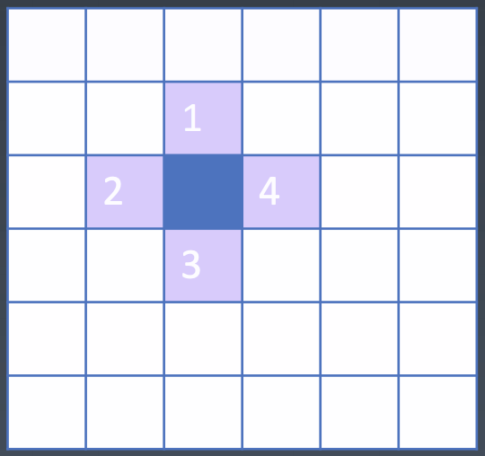

## 寻路问题

### 画迷宫

1. 画矩阵： 为了让寻路的过程更加直观，我们需要将这个过程可视化。先画一个 100 x 100 的矩阵，每一个格子表示一个位置。
2. 鼠标绘制： 得到了矩阵地图之后我们还需要给一些障碍物，我们当然可以给这 10000 个格子一个个的设置，但是这样效率太低。我们希望可以像画图软件一样用鼠标就能画出一个迷宫。
3. 持久化： 给页面添加 save 和 clear 按钮，代码非常简单，要注意的是 clear 的时候需要重新加载页面，不然 map 的数据在内存还是存在的。

```
<style>
  ......
  button {
    margin-top: 10px;
  }
</style>

<div id="container"></div>
<button onclick="localStorage.map = JSON.stringify(map);">save</button>
<button onclick="delete localStorage.map;location.reload();">clear</button>

<script>
  let map = localStorage.map ? JSON.parse(localStorage.map) : new Array(10000).fill(0);
  // ......
</script>
```

### 广度优先搜索（BFS)

> 有了迷宫，接下来就是寻路了。搜索算法最常用的就是 DFS（深度优先搜索）和 BFS（广度优先搜索）。DFS 就是一条路走到黑，直到找到目标或者没有路可走了。BFS 就是会尝试周围所有的可能，然后向外扩散，就像一个涟漪一样一圈一圈的向外扩散开。DFS 就是能确定一定能找到答案，而 BFS 就能找到最佳路径。
> 所以我们这里用 BFS 来完成这个寻路，先只考虑可以走上、下、左、右 4 个方向。
> 

```
 function findPath(map, start, end) {
        var queue = [start];
        function insert(x, y) {
          // 遇到边缘就无法insert
          if (x < 0 || x >= 100 || y < 0 || y >= 100) {
            return;
          }
          // 如果有障碍物
          if (map[y * 100 + x]) {
            return;
          }
          // 新的节点标为2
          map[y * 100 + x] = 2;
          queue.push([x, y]);
        }

        while (queue.length) {
          let [x, y] = queue.shift();
          console.log(x, y);
          if (x === end[0] && y === end[1]) {
            return true;
          }
          insert(x - 1, y); // 左
          insert(x, y - 1); // 右
          insert(x + 1, y); // 上
          insert(x, y + 1); // 下
        }
        return false;
      }
```

> BFS 的代码其实非常简单，需要借助队列的特性先入先出，每次出队一个坐标，先判断当前的坐标是不是终点，如果是，就直接结束了。如果不是，就依次将上、下、左、右的坐标入队。当然入队前先要判断是不是障碍物和边界条件，然后再将当前的点标记为 2 表示已经访问过了。这样就会像涟漪一样一圈一圈的往外扩散式的搜索。

> 我们在控制台手动执行 findPath(map, [0,0], [99,99])，稍等一段时间就能返回 true，告诉我们能找到终点。
> [screenshot](./2.png)

### 可视化

> 上面的过程非常单调，我们只能看到坐标一直在变，对于我们人类来说非常不直观。因此我们就要将这个搜索的过程可视化，其实也非常简单就是将访问过的格子染个色。
> 这里我们需要用到异步编程的内容了，用 async await 将 findPath 改成一个异步函数，并且配合 Promise 封装的 sleep 函数，来完成可视化。就是在访问每个格子（将格子对应的值赋值为 2）时，将格子改成淡绿色，再等待 5ms。在进行下一步。

```
async function findPath(map, start, end) {
        var queue = [start];
        async function insert(x, y) {
          // 遇到边缘就无法insert
          if (x < 0 || x >= 100 || y < 0 || y >= 100) {
            return;
          }
          // 如果有障碍物
          if (map[y * 100 + x]) {
            return;
          }
          await sleep(30);
          container.children[y * 100 + x].style.backgroundColor = "lightgreen";
          // 新的节点标为2
          map[y * 100 + x] = 2;
          queue.push([x, y]);
        }

        while (queue.length) {
          let [x, y] = queue.shift();
          // console.log(x, y);
          if (x === end[0] && y === end[1]) {
            return true;
          }
          await insert(x - 1, y); // 左
          await insert(x, y - 1); // 右
          await insert(x + 1, y); // 上
          await insert(x, y + 1); // 下
        }
        return false;
      }
```

### 寻路--8 个方向

> 上面我们已经实现了从起始点走到结束点，但是还没有找出最佳路径。为了要找出最佳路径，我们还需要修改一下 \table 的数据结构，当格子被访问过时，不能只是将对应的数据存储成 2，而是要存储上一步的坐标。
> 这部分的代码如下，就是每次 insert 的时候都带上上一步的坐标。然后> 在找到终点时，从终点根据存储的上一个坐标反推到起点，就得到了最终的路径。
> 在前面只考虑上、下、左、右 4 个方向，如果我们规定可以斜着走，那么就还有左上、右上、左下、右下，一共有 8 个方向了。
> 其实这部分的代码也非常简单，就是上面 4 个方向代码基础之上加上斜向的 4 个方向。

```

      async function findPath(map, start, end) {
        var table = Object.create(map);
        var queue = [start];
        async function insert(x, y, pre) {
          // ...
          table[y * 100 + x] = pre;
          // ...
        }

        while (queue.length) {
          let [x, y] = queue.shift();
          // console.log(x, y);
          if (x === end[0] && y === end[1]) {
            let path = [];
            while (x !== start[0] || y !== start[1]) {
              path.push(map[y * 100 + x]);
              [x, y] = table[y * 100 + x];
              await sleep(30);
              container.children[y * 100 + x].style.backgroundColor = "purple";
            }
            return path;
          }
          await insert(x - 1, y, [x, y]); // 左
          await insert(x, y - 1, [x, y]); // 右
          await insert(x + 1, y, [x, y]); // 上
          await insert(x, y + 1, [x, y]); // 下

          // 斜向
          await insert(x - 1, y - 1, [x, y]);
          await insert(x + 1, y - 1, [x, y]);
          await insert(x - 1, y + 1, [x, y]);
          await insert(x + 1, y + 1, [x, y]);
        }
        return null;
      }
```

### 寻路（优化）-- A\*

1. 寻找两点之间的最短路径这个问题，其实数学家们已经帮我们找到了最优解，就是 A\* 搜索算法。
2. 简单来说就是，根据当前点与终点之间的距离不断进行剪枝。我们之前是依次遍历 8 个方向的每一个方向，没有优先级，直到找到终点。而 A\* 算法就是要在所有可以走的坐标点中间，选择一个与终点距离最近的点来走。不断调整方向，最后就能得到最优路径。这个算法的准确性是数学家在数学上严格证明过的。
3. 修改数据的「待访问点」的数据结构，不能用一个队列来存储。而是要用一个新的数据结构，它要满足我们每次都可以取到最小的值。

```
class Sorted {
        constructor(data, compare) {
          this.data = data.slice();
          this.compare = compare || ((a, b) => a - b);
        }
        take() {
          if (!this.data.length) {
            return;
          }
          let min = this.data[0];
          let minIndex = 0;
          for (let i = 1; i < this.data.length; i++) {
            if (this.compare(this.data[i], min) < 0) {
              min = this.data[i];
              minIndex = i;
            }
          }
          this.data[minIndex] = this.data[this.data.length - 1];
          this.data.pop();
          return min;
        }
        give(v) {
          this.data.push(v);
        }
      }
```

> 构造函数接受一个 data（所有的数据）和一个 compare（数据的大小比较我们把接口放到调用者去实现，我们只要求，前一个数比后一个数大是返回正数，反之给我们返回负数即可）。
> take() 方法也非常简单，每次都在 data 中取最小的那个数据。最小的数被取出之后，就有一个空位，然后我们的数组是无序的，所以只需要将最后一个数填到当前的最小值的空位即可。最后将这个最小值返回。
> insert() 方法只需要将数据插入到数组的末尾。length 是一个 get 方法，这是是为了 BFS 的代码而加上的。
> 有了新的数据结构 Sorted，我们接下来就是修改 BFS 部分涉及到 queue 的代码。都要改成 Sorted 结构。

```
async function findPath(map, start, end) {
  let table = Object.create(map);
  let collection = new SortedArray([start], (a, b) => distance(a) - distance(b));

  while (collection.length) {
    let [x, y] = collection.take();
    // ......
  }
  return null;

  async function insert([x, y], pre) {
    // ......
    collection.insert([x, y]);
  }
  function distance([x, y]) {
    return (x - end[0]) ** 2 + (y - end[1]) ** 2;
  }
}
```

> compare() 算法就使用两点间距离公式来比较，并且我们只涉及大小比较，就可以省去开根号这个耗时的运算。
> 最后 A\* 就给我们找到了最优的解，并且遍历的位置也非常非常少。

### 寻路（优化）-- 二叉小顶堆
