## 字符串分析算法

> 前端最主要的工作就是处理「内容呈现」和「用户交互」，其中内容呈现中无非就是图像和文字，因此关于字符串的算法是非常重要的。
> 其实很多编程语言提供了「字符串查找」的函数，如，JS 中的 indexOf、lastIndexOf、includes 等等。它们的底层其实就是依赖的「字符串匹配算法」。

## 字典树（Trie 树）

- Trie 树，也叫“字典树”。顾名思义，它是一个树形结构。它是一种专门处理字符串匹配的数据结构，用来解决在一组字符串集合中快速查找某个字符串的问题。典型的应用就是用于统计和排序大量的字符（但不仅限于字符串），所以经常被搜索引擎系统用于文本词频统计。它的优点是：最大限度地减少无谓的字符串比较，查询的效率比哈希表高。
  
- 举个简单的例子来说明一下。我们有 6 个字符串，它们分别是：how，hi，her，hello，so，see。我们希望在里面多次查找某个字符串是否存在。如果每次查找，都是拿要查找的字符串跟这 6 个字符串依次进行字符串匹配，那效率就比较低，有没有更高效的方法呢？
- 这个时候，我们就可以先对这 6 个字符串做一下预处理，组织成 Trie 树的结构，之后每次查找，都是在 Trie 树中进行匹配查找。Trie 树的本质，就是利用字符串之间的公共前缀，将重复的前缀合并在一起。最后构造出来的就是下面这个图中的样子。
  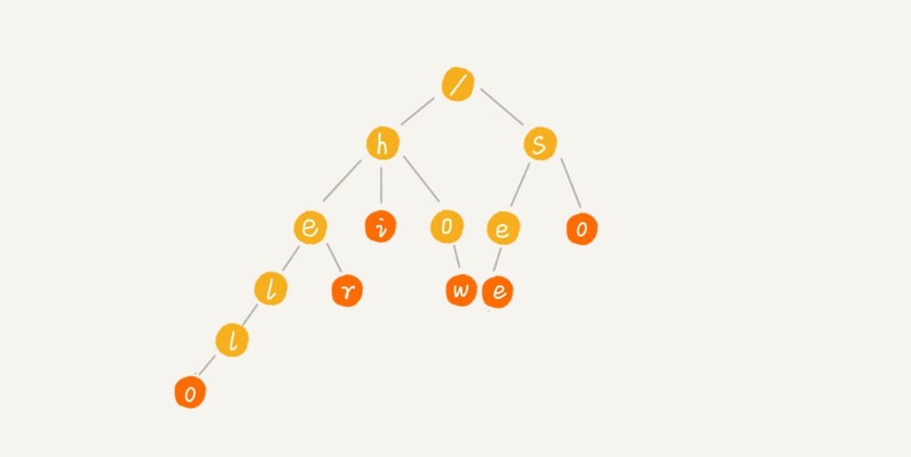
- 其中，根节点不包含任何信息。每个节点表示一个字符串中的字符，从根节点到红色节点的一条路径表示一个字符串（注意：红色节点并不都是叶子节点）。构造过程的每一步，都相当于往 Trie 树中插入一个字符串。当所有字符串都插入完成之后，Trie 树就构造好了。
  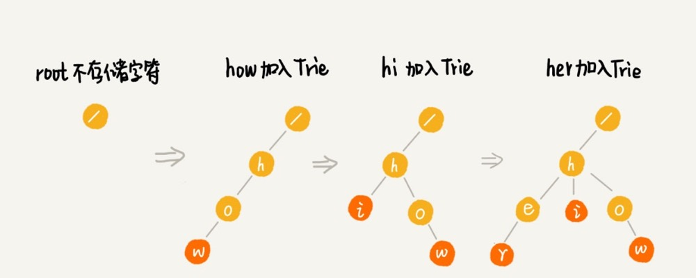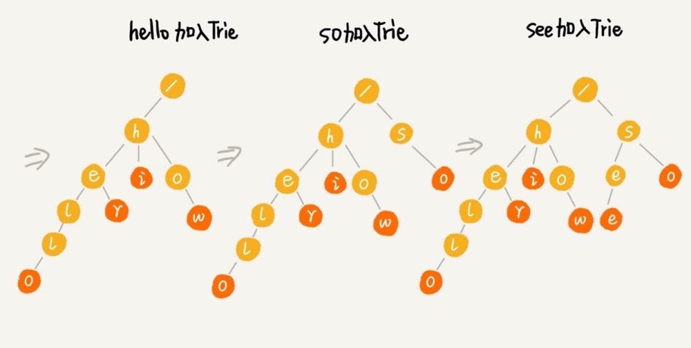
- 当我们在 Trie 树中查找一个字符串的时候，比如查找字符串“her”，那我们将要查找的字符串分割成单个的字符 h，e，r，然后从 Trie 树的根节点开始匹配。如图所示，绿色的路径就是在 Trie 树中匹配的路径。
  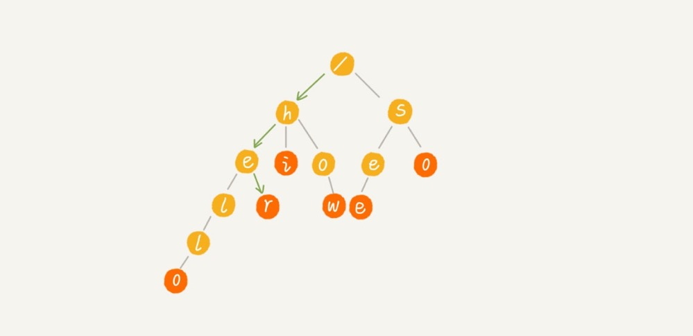
- 如果我们要查找的是字符串“he”呢？我们还用上面同样的方法，从根节点开始，沿着某条路径来匹配，如图所示，绿色的路径，是字符串“he”匹配的路径。但是，路径的最后一个节点“e”并不是红色的。也就是说，“he”是某个字符串的前缀子串，但并不能完全匹配任何字符串。
  

### 实现

- 那么这个数据结构我们应该怎么实现呢？从前面来看，Trie 树主要有两个操作，一个是将字符串插入到 Trie 树中，另一个是在 Trie 树中查询一个字符。

```let endOfWord = Symbol("$"); // 利用Symbol的不可重复的特点防止字符串中本身存在的$
class Trie {
    constructor() {
        // Object.create(null)创建字符串，避免收到Object.prototype上面的污染
        this.root = Object.create(null);
    }
    insert(word) {
        let node = this.root;
        for (let char of word) {
            if (!node[char]) {
                // 如果子树不存在，就先创建子树
                node[char] = Object.create(null);
            }
            node = node[char];
        }
        node[endOfWord] = node[endOfWord] + 1 || 1;
    }
}
```

- 这里多定义一个结束符号“\$",对应图片中的红色。我们还给结束符号加了统计次数的能力。基于这个能力，我们就可以实现很多功能。比如，找到出现次数最多的字符串。主要的思想就遍历整棵树，然后比较 endOfWord 中存储的值。

```
class Trie {
  // ......

  /** 找出出现最多的随机字符串 */
    most() {
        let max = 0;
        let maxWord = null;
        let visit = (node, word) => {
            if (node[endOfWord] && node[endOfWord] > max) {
                max = node[endOfWord];
                maxWord = word;
            }
            for (let p in node) {
                visit(node[p], word + p);
            }
        };
        visit(this.root, "");
        console.log(maxWord, max);

        return { maxWord, max };
    }

}
```

## 状态机、正则

- 我们前面处理字符串用的是「有限状态机」和「正则」。这两种方式都很强大，状态机几乎可以做所有事情，不过自己要编写的代码量非常大，成本比较高。正则其实是用状态机实现的，只不过它的性能不太好，会回溯。

## 单模式串匹配的算法(也就是一个串跟一个串进行匹配)

1. BF 算法（暴力匹配算法/朴素匹配算法）

   > 理解两个概念：主串和模式串
   > 比方说，我们在字符串 A 中查找字符串 B，那字符串 A 就是主串，字符串 B 就是模式串。我们把主串的长度记作 n，模式串的长度记作 m。因为我们是在主串中查找模式串，所以 n>m。
   > 作为最简单、最暴力的字符串匹配算法，BF 算法的思想可以用一句话来概括，那就是，我们在主串中，检查起始位置分别是 0、1、2…n-m 且长度为 m 的 n-m+1 个子串，看有没有跟模式串匹配的。举一个例子看看。
   > 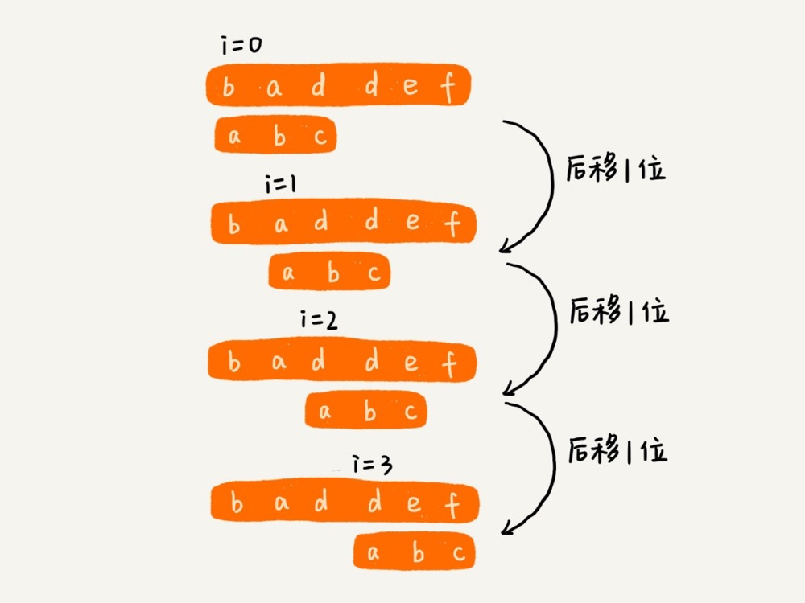
   > 从上面的算法思想和例子，我们可以看出，在极端情况下，比如主串是“aaaaa…aaaaaa”（省略号表示有很多重复的字符 a），模式串是“aaaaab”。我们每次都比对 m 个字符，要比对 n-m+1 次，所以，这种算法的最坏情况时间复杂度是 O(n*m)。
   > 尽管理论上，BF 算法的时间复杂度很高，是 O(n*m)，但在实际的开发中，它却是一个比较常用的字符串匹配算法。为什么这么说呢？原因有两点。
   > 第一，实际的软件开发中，大部分情况下，模式串和主串的长度都不会太长。而且每次模式串与主串中的子串匹配的时候，当中途遇到不能匹配的字符的时候，就可以就停止了，不需要把 m 个字符都比对一下。所以，尽管理论上的最坏情况时间复杂度是 O(n\*m)，但是，统计意义上，大部分情况下，算法执行效率要比这个高很多。
   > 第二，朴素字符串匹配算法思想简单，代码实现也非常简单。简单意味着不容易出错，如果有 bug 也容易暴露和修复。在工程中，在满足性能要求的前提下，简单是首选。这也是我们常说的 KISS（Keep it Simple and Stupid）设计原则。

2. RK 算法（Rabin-Karp 算法，是由它的两位发明者 Rabin 和 Karp 的名字来命名的）
   > 它其实就是刚刚讲的 BF 算法的升级版。BF 算法中，如果模式串长度为 m，主串长度为 n，那在主串中，就会有 n-m+1 个长度为 m 的子串，我们只需要暴力地对比这 n-m+1 个子串与模式串，就可以找出主串与模式串匹配的子串。
   > 但是，每次检查主串与子串是否匹配，需要依次比对每个字符，所以 BF 算法的时间复杂度就比较高，是 O(n\*m)。我们对朴素的字符串匹配算法稍加改造，引入哈希算法，时间复杂度立刻就会降低。
   > RK 算法的思路是这样的：我们通过哈希算法对主串中的 n-m+1 个子串分别求哈希值，然后逐个与模式串的哈希值比较大小。如果某个子串的哈希值与模式串相等，那就说明对应的子串和模式串匹配了（这里先不考虑哈希冲突的问题）。因为哈希值是一个数字，数字之间比较是否相等是非常快速的，所以模式串和子串比较的效率就提高了。
   > 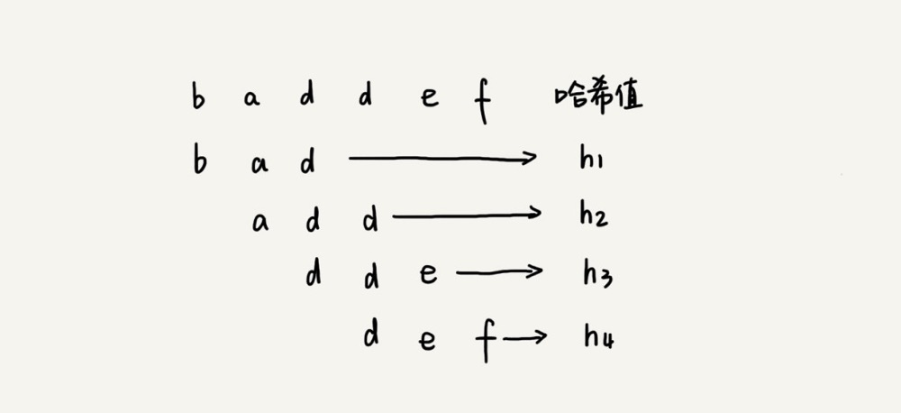
   > 不过，通过哈希算法计算子串的哈希值的时候，我们需要遍历子串中的每个字符。尽管模式串与子串比较的效率提高了，但是，算法整体的效率并没有提高。有没有方法可以提高哈希算法计算子串哈希值的效率呢？
   > 这就需要哈希算法设计的非常有技巧了。我们假设要匹配的字符串的字符集中只包含 K 个字符，我们可以用一个 K 进制数来表示一个子串，这个 K 进制数转化成十进制数，作为子串的哈希值。表述起来有点抽象，举个例子。
   > 比如要处理的字符串只包含 a ～ z 这 26 个小写字母，那我们就用二十六进制来表示一个字符串。我们把 a ～ z 这 26 个字符映射到 0 ～ 25 这 26 个数字，a 就表示 0，b 就表示 1，以此类推，z 表示 25。
   > 在十进制的表示法中，一个数字的值是通过下面的方式计算出来的。对应到二十六进制，一个包含 a 到 z 这 26 个字符的字符串，计算哈希的时候，我们只需要把进位从 10 改成 26 就可以。 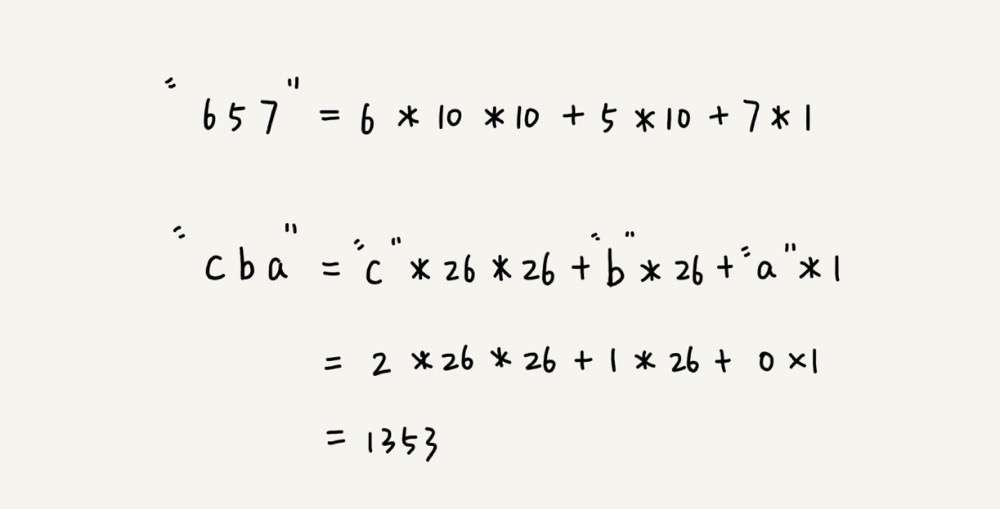
   > 这个哈希算法你应该看懂了吧？现在，为了方便解释，在下面的讲解中，我假设字符串中只包含 a ～ z 这 26 个小写字符，我们用二十六进制来表示一个字符串，对应的哈希值就是二十六进制数转化成十进制的结果。这种哈希算法有一个特点，在主串中，相邻两个子串的哈希值的计算公式有一定关系。有个例子，先找一下规律：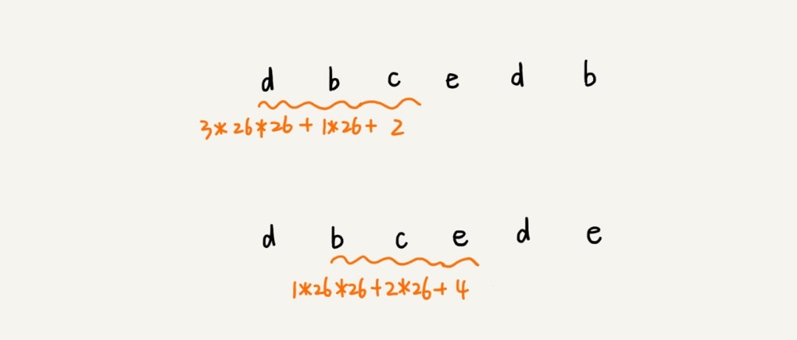
   > 从这里例子中，我们很容易就能得出这样的规律：相邻两个子串 s[i-1]和 s[i]（i 表示子串在主串中的起始位置，子串的长度都为 m），对应的哈希值计算公式有交集，也就是说，我们可以使用 s[i-1]的哈希值很快的计算出 s[i]的哈希值。如果用公式表示的话，就是下面这个样子
3. BM 算法（Boyer-Moore 算法）

- BM 算法的思想就是，在遇到不匹配的字符时，是不是模式串可以一次性往后多移动几位。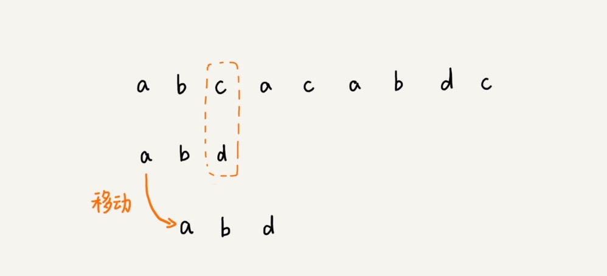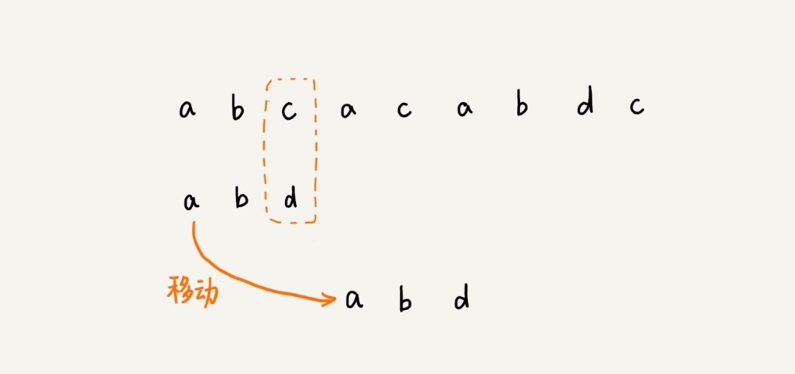

4. KMP 算法 （D.E.Knuth，J.H.Morris 和 V.R.Pratt，其中 D.E.Knuth 就是我们著名的计算机算法之父「高德纳」）

- 在长字符串里找模式。检查一个长字符串中有没有一个段字符串的部分匹配
  其实 KMP 的思想跟 BM 是差不多的，都是在匹配的过程中，遇到不匹配的字符时，模式串可以一次往后多滑动几位。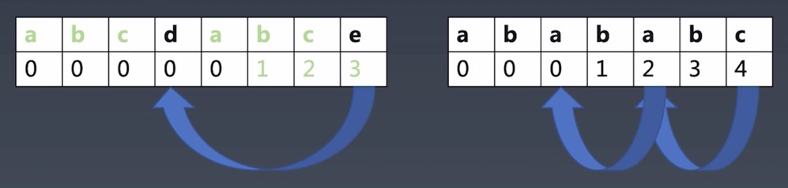
- KMP 算法分为两个部分：
  - 第一部分，求跳转表格
  - 第二部分，进行真正的匹配
- KMP 代码实现

  ```
  function kmp(source, pattern) {
    // 第一部分：计算table
    let table = new Array(pattern.length).fill(0);

    {
        // i 表示自重复串的开始位置，j 表示已重复字数
        let i = 1,
            j = 0;
        while (i < pattern.length) {
            // 有自重复
            if (pattern[i] === pattern[j]) {
                ++j, ++i;
                // table[i]=j 代表第i位前面有长度为j的公共子串
                table[i] = j;
            } else {
                // 不匹配
                if (j > 0) {
                    j = table[j];
                } else {
                    ++i;
                }
            }
        }
    }
    // 第二部分：匹配
    {
        // i表示source串的位置  j表示pattern串的位置
        let i = 0,
            j = 0;

        while (i < source.length) {

            if (pattern[j] === source[i]) {
                ++i, ++j;
            } else {
                // 不匹配，pattern位置就要回退到table里
                if (j > 0) {
                    j = table[j];
                } else {
                    ++i;
                }
            }
            // 如果模式串匹配到头了，结束
            if (j === pattern.length) {
                return true;
            }
        }
        // 如果source串到头了，return false
        return false;
    }
  }
  ```

## Wildcard

- 带通配符的字符串模式。在 KMP 基础上添加通配符（?: 匹配任意字符 \*：表示匹配任意数量的任意字符）
- wildcard: ab*c?d*abc\*a?d
  - 只有*: ab*cd*abc*a?d
  - 只有?: c?d, a?d
- 对于 ab*cd*abc\*a?d 这个例子，如果没有最后面的 a?d,就相当于若干个 KMP 匹配，如果有问号，就比较复杂，可以用正则来解决。
- 这个题目在 leetcode 上也有原题：[44. 通配符匹配](https://leetcode-cn.com/problems/wildcard-matching/)。

## LL LR

- 字符串多层级结构分析
