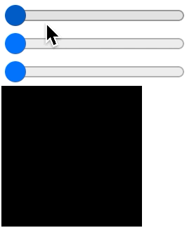

## Proxy
- Proxy 可以为另一个对象创建一个代理，该代理可以拦截和重新定义该对象的基本操作（get、set、constructor 等等,  https://developer.mozilla.org/zh-CN/docs/Web/JavaScript/Reference/Global_Objects/Proxy
- Proxy 设计出来其实是给库和语言框架的设计者去使用的，在业务开发中一般都不允许使用。因为使用了之后，对象的 get、set 等基本操作最后可能都不是原来的意义。
- const p = new Proxy(target, handler)
- proxy 的构造函数接受两个参数：target 要使用 Proxy 包装的目标对象（可以是任何类型的对象，包括原生数组，函数，甚至另一个代理）。handler 一个通常以函数作为属性的对象，各属性中的函数分别定义了在执行各种操作时代理 p 的行为。
-  
```
<script>
      let object = {
        a: 1,
        b: 2,
      };
      let po = new Proxy(object, {
        set(obj, prop, val) {
          console.log(obj, prop);
        },
      });

      // 这个就是调用 get
      po.a;

      // 使用 set，是一个默认行为
      po.a = 11;
    </script>
```

## Reactive
 Reactive 是 Vue3.0 中实现双向绑定的基础，其实是一个类似于 Observable 的东西。监听一个对象的变化，然后改变另一个东西的值。因此我们就可以将前面的 Proxy 代码改造成 reactive。
 ```
<script>
  function reactive(obj) {
    return new Proxy(obj, {
      get(obj, prop) {
        console.log(obj, prop)
        return obj[prop];
      },
      set(obj, prop, val) {
        obj[prop] = val;
        return val;
      }
    })
  }
</script>
 ```

 Reactive 我们就可以做各种适用于双向绑定的例子: RGB 调色盘
 ```
<input id="r" type="range" min="0" max="255">
<input id="g" type="range" min="0" max="255">
<input id="b" type="range" min="0" max="255">

<div id="color" style="width:100px;height:100px;"></div>

<script>
  // ......

  
  let p = reactive({ r: 0, g: 0, b: 0 });
  effect(() => {
    document.getElementById("r").value = p.r;
  })
  document.getElementById("r").addEventListener("input", event => {
    p.r = event.target.value;
  })

  effect(() => {
    document.getElementById("g").value = p.g;
  })
  document.getElementById("g").addEventListener("input", event => {
    p.g = event.target.value;
  })

  effect(() => {
    document.getElementById("b").value = p.b;
  })
  document.getElementById("b").addEventListener("input", event => {
    p.b = event.target.value;
  })

  effect(() => {
    document.getElementById("color").style.backgroundColor = `rgb(${p.r}, ${p.g}, ${p.b})`
  })
</script>
 ```

这个代码非常的清晰明了，就是每个 range 类型的 input 都与 p 的值进行绑定，然后 color 的 backgroundColor 与 p 的 r、g、b 三个值绑定起来。

最后就得到一个 RGB 的调色盘了：



## range 和DOM的应用
CSSOM和range实现拖拽, 并且能与文字混排


### 1. 添加 mouse 事件
 - 第一我们就是实现对一个方块的拖拽，关于拖拽的问题在 寻路问题 的鼠标绘制部分我们详细介绍过，就是监听方块的 mousedown 事件和 document 的 mousemove 和 mouseup 事件。
```
<div id="draggable" style="width:100px;height:100px;background-color:pink;"></div>

<script>
  let draggable = document.getElementById('draggable');
  // document 的事件需要写在 draggable 方块的 mousedown 之内。还要记得 remove document 的事件，因为 document 的事件不主动 remove 就会一直触发，就算光标已经移出了 draggable 方块的区域
  draggable.addEventListener('mousedown', () => {
    let move = event => {
      console.log(event);
    }
    let up = () => {
      document.removeEventListener('mousemove', move);
      document.removeEventListener('mouseup', up);
    }
    document.addEventListener('mousemove', move);
    document.addEventListener('mouseup', up);
  });
</script>
```

### 2. 移动 draggable 方块
在 mousedown 中记录起始点坐标 startX 和 startY，然后在 mousemove 中计算出当前坐标相对于起始点的偏移量 x 和 y，再用 transform 的 translate 来平移方块。最后在 mouseup 中记录基准点 baseX 和 baseY，它们会记住每次移动后的最终位置。
```
<div id="draggable" style="width:100px;height:100px;background-color:pink;"></div>

<script>
  let draggable = document.getElementById('draggable');

  let baseX = 0;
  let baseY = 0;
  draggable.addEventListener('mousedown', event => {
    let startX = event.clientX;
    let startY = event.clientY;

    let move = event => {
      let x = baseX + event.clientX - startX;
      let y = baseY + event.clientY - startY;
      draggable.style.transform = `translate(${x}px,${y}px)`;
    }
    let up = event => {
      baseX = baseX + event.clientX - startX;
      baseY = baseY + event.clientY - startY;
      document.removeEventListener('mousemove', move);
      document.removeEventListener('mouseup', up);
    }
    document.addEventListener('mousemove', move);
    document.addEventListener('mouseup', up);
  });
</script>
```
### 3. 收集文本的 Range
弄一个超长文本的 div，然后要收集所有的可插的位置，也就是 ranges。对整个文本以字符为单位创建对应的 range 并放入 ranges 中。
```
<div id="container">
      文字 文字 文字 文字 文字 文字 文字 文字 文字 文字 文字 文字 文字 文字 文字
      文字 文字 文字 文字 文字 文字 文字 文字 文字 文字 文字 文字 文字 文字 文字
      ...
    </div>
    <div
      id="dragable"
      style="
        display: inline-block;
        width: 100px;
        height: 100px;
        background-color: pink;
      "
    ></div>

 <script>
   ...
  let ranges = [];
  let container = document.getElementById('container');
  for (let i = 0; i < container.childNodes[0].textContent.length; i++) {
    let range = document.createRange();
    range.setStart(container.childNodes[0], i);
    range.setEnd(container.childNodes[0], i);
    console.log(range.getBoundingClientRect())
    ranges.push(range);
      ...
  }     
</script>
      
      
```
### 4. 方块与文字混排
想要将方块插入文字中间，那么方块首先需要加上 display:inline-block; 变成 inline-block。然后就是计算「方块的坐标」与「文字的 rang」之间的关系。
```
...
/** 找到离某一个point最近的range */
      function getNearestRange(x, y) {
        let min = Infinity;
        let nearest = null;

        for (let range of ranges) {
          let rect = range.getBoundingClientRect();
          let distance = (rect.x - x) ** 2 + (rect.y - y) ** 2;
          if (distance < min) {
            nearest = range;
            min = distance;
          }
        }
        return nearest;
      }

...
```
我们的 getNearestRange 函数的 x 和 y 就是方块的坐标，然后每个 range 的坐标我们可以通过 getBoundingClientRect() 得到，最后遍历整个 ranges 得到与方块最近的 range。

最后就是改变 mousedown 中的 move 函数，我们不是要移动方块，而是要插入到文字中间去。
```
let move = (event) => {
    //   dragable.style.transform = `translate(${
    //     baseX + event.clientX - startX
    //   }px, ${baseY + event.clientY - startY}px)`;
    let range = getNearestRange(event.clientX, event.clientY);
    range.insertNode(dragable);
};
```