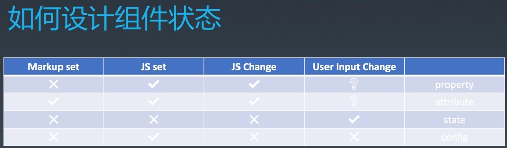

前端架构组热门的两个话题是组件化和架构模式，一般来说，我们认为组件它跟 UI 强相关的一种东西，某种意义上说，可以认为它是一种特殊的模块，或是特殊的对象。它的特点就是可以以树形结构进行组合，并且有模块化配置的能力。

## Object（对象）

对于编程语言中的「对象」来说，我们主要有 3 个特征：

- Properties（属性）
- Methods（方法）
- Inherit（继承）

## Component（组件）

然后「组件」在对象的 3 个特征的基础之上，又加了 6 个特征：

- Properties（属性）
- Methods（方法）
- Inherit（继承）
- Attribute（特性）
- Config & State（配置和状态）
- Event（事件）
- LifeCycle（生命周期）
- Children（子组件）

关于组件的这些东西，我们可以用一张图来表示它们与组件之间的关系。


## Attribute vs Property

Attribute 和 Property 在中文其实都是翻译成「属性」，当这两个一起出现时还可能会把 Attribute 翻译成「特性」。其实在英文中，Attribute 是强调描述性（比如，外观），Property 是强调从属关系（比如，财产）。

在语言层面来说，Property 是没有办法在 HTML（标记语言）去设置和更改的。而 Attribute 则是在标记语言中能够设置和更改的，当然在 JS 中也是可以修改 Attribute 的。

```
Attribute:
<my-component attribute="v" />
myComponent.getAttribute("attribute");
myComponent.setAttribute("attribute", "value");

Propert:
myComponet.p = "value";
```

在 HTML 和 JavaScript 中，Attribute 和 Property 很多时候是重合的。如，id、class 等。

id 在 HTML 和 JS 中名字都是一样的，然后 class 在 JS 中名字变成了 className（因为在 JS 中关键字不能做属性名，但是最新的标准是允许这么做了），虽然有名字上的差别，但是它们都是表达的同一个东西。

```
<div class="cls1 cls2"></div>
<script>
  let div = document.getElementsByTagName("div")[0];
  div.className // cls1 cls2
</script>
```

在 HTML 和 JavaScript 中，Attribute 和 Property 也有不重合的时候。

如，style。在 HTML 中是 Attribute，而在 JS 中是一个 style 对象，不过它们最后在语义上是相通的。

```
<div style="color:blue"></div>
<script>
  let div = document.getElementsByTagName("div")[0];
  div.style // 对象
</script>
```

如，href。它的 Attribute 和 Property 完全不同，而且是一个「单向反射关系」，就是修改一个另一个不会跟着改变。

```
<a href="yuque.com/wendraw"></a>
<script>
    let a = document.getElementsByTagName("a")[0];
  a.href // "https://www.yuque.com/wendraw" 这个 URL 是 resolve 过的结果，将相对路径补全成绝对路径
  a.getAttribute("href") // "yuque.com/wendraw" 跟 HTML 代码中完全一致
</script>
```

还有一个要特别注意 ⚠️ 的情况就是 value。它的 Attribute 跟 Property 看似两者等效，但其实是一个「单向同步关系」。它取决于是否手动设置过 property，如果没有设置过，attribute 和 property 两者是完全等效的。如果设置过，attribute 就再也不会变了，只有 property 会产生变化。

```
<input value="cute" />
<script>
  let input = document.getElementsByTagName("input")[0];
  // property 没有设置过，其结果就是 attribute
  input.value; // cute
  input.getAttibute("value") // cute

  // 设置过 value 属性，则 attribute 不变，property 变化，元素上实际效果是 property 优先。
  input.value = "hello";
  input.value; // hello
  input.getAttibute("value") // cute
</script>
```

这就是 Property 和 Attribute 不一致导致的问题，稍加不注意就会出大问题。然后在 JQ 和 Vue 中都是有区分 Property 和 Attribute 的。不过在 React 中把它们设计成一个东西，所以一般不会这种问题

## config vs state

- config 就是对组件的一种配置，我们在构造函数里面创建一个对象的时候，在构造函数里面传入的参数就是 config
- state 就是随着人的操作或者一些方法的调用，组件 state 会发生一些变化

## 如何设计组件状态

- 组件状态我们到底应该怎么设计呢？
  - Property：不可以被 Markup（标记语言）设置，可以被 JS 设置和改变，有可能会根据用于输入而改变。
  - Attribute：可以被 Markup 设置，可以被 JS 设置和改变，有可能会根据用户输入而改变。
  - State：只会根据用户输入而改变。
  - Config：只能由 JS 去设置（config 一般是全局的，由构造函数传入，不会被修改）。



## Lifecycle（生命周期）

组件一般来说要有一个生命周期，因为组件一般来说有几个生不由己的时刻。比如说，create（创建）、destroyed（销毁）。然后在这两个状态之间还可以有一些别的状态，来做一些事情。


## Children

children 是构建组件树最重要的一个特性。它有两种类型的 children

1. Content 型 Children

```
<my-button>
  
  {{title}}
</my-button>
```

2. Template 型 Children

```
<my-list data={{data}} >
  <li>
    
    {{title}}
  </li>
</my-list>
```
