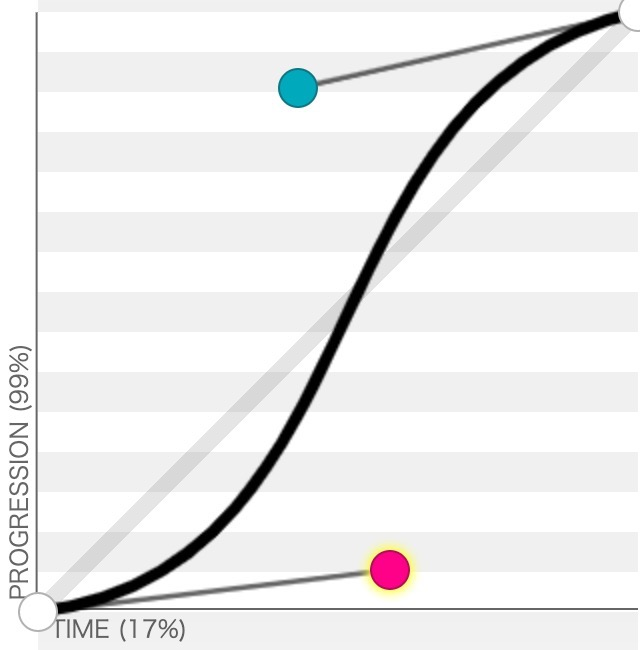

## JS 中处理帧的方案

1. setInterval(()=>{}, 16)
2. setTimeout

```
let tick = () => {
	setTimeout(tick, 16);
}
```

3. requestAnimationFrame(浏览器提供的动画接口，每一帧都会执行一次回调函数）)

```
let tick = () => {
	requestAnimationFrame(tick, 16);
}
```

与 requestAnimationFrame 对应的是 cancelAnimationFrame

## JavaScript 动画

```
let animation = new Animation({ object, property, template, start, end, duration, delay, timingFunction });
```

- object：是想要添加动画的对象；
- property：是想要变换的属性；
- start：是属性的初始值；
- end：是属性的最终值；
- duration：整个动画的持续时间；
- delay：动画延迟多长时间开始播放；
- timingFunction：差值算法。
- template：是一个抽象出来的属性的模版，是对不同的 property 的抽象（不同 property 要求的字符串不一样）。

### Animation

抽象之后 Animation 就会非常简单，只是一个记录各种状态的数据结构。

```
// animation.js
export class Animation {
  constructor(option) {
    let { object, property, template, start, end, duration, delay, timingFunction } = option;
    this.object = object;
    this.property = property;
    this.start = start;
    this.end = end;
    this.duration = duration;
    this.delay = delay || 0;
    this.timingFunction = timingFunction;
    this.template = template;
  }
}
```

其中 timingFunction 是差值算法，会设计的跟 CSS 动画中的 timing-function 是一致的，也就是对应的 linear、ease、ease-in、ease-out 差值算法等等。

### Timeline（时间线）

那么 Timeline 就应该是下面这样子：

```
// animation.js
const TICK = Symbol("tick");
const TICK_HANDLER = Symbol("tick");
export class Timeline {
  constructor() {
    this.animations = [];
  }

  tick() {
    this[TICK] = () => {
        console.log('tick');
        this[TICK_HANDLER] = requestAnimationFrame(this[TICK]);
    }
     this[TICK]();
  }

  add(animation) {}

  start(){
    this[TICK]();
  }
  pause(){}
  resume(){}
  restart(){}
}
```

我们发现比之前的分析多了一个 tick() 方法，这个方法其实是 Timeline 的核心。tick 是钟表滴答滴答的声音，因此我们一般用 tick 来表示动画的每一帧要执行的东西。

其实到这里，一个动画的基本框架已经搭建好了，我们将它跑起来，看看 tick 的效果。

```
// animation.html
<script type="module">
  import { Timeline } from "./animation.js";

  let tl = new Timeline();
  tl.start();
</script>
```

完整代码见 carousel 目录

我们这里的插值算法 timingFunction ，CSS 中的 timing-function 其实是「三次贝塞尔曲线」的差值算法。在 https://cubic-bezier.com/#.25,.1,.25,1 可以很直观的看到 ease 曲线如下图：


可以看到入参是一个 time，其值是 0 ～ 1。然后经过 ease 差值函数会得到 progression，其值也是 0 ～ 1。并且最终构成上图中的曲线。

也就是插值算法会根据当前经过的时间比（0 ～ 100%），得到进度的时间比（0 ～ 100%）。

## 总结

用 CSS 动画如果碰到更复杂的场景，比如有多个 rect，然后我们想要在一个 rect 运动途中加入进去，这种 feature 就比较难处理了。用 JS 动画解决了 CSS 动画的问题，最后逐步完善了我们的 JS 动画库，最终得到了一个产生级别的动画库。

对于 JS 动画来说最重要的就是 Animation 和 Timeline 的抽象。特别是有了 Timeline 之后，能够轻松解决多动画的控制问题。
