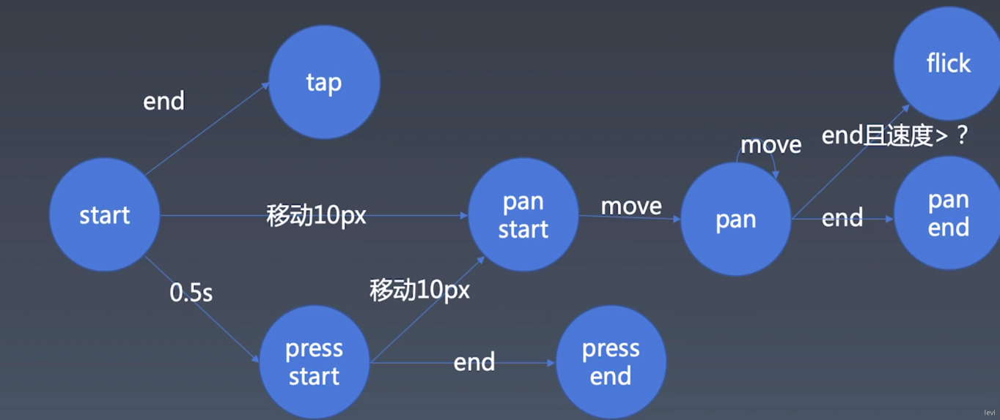

<!--
 * @description: description
 * @author: liuyun03
 * @Date: 2020-07-23 16:30:46
 * @LastEditors: liuyun03
 * @LastEditTime: 2020-11-16 09:57:20
-->

## 手势和动画



- tap：短按，可以认为是类似鼠标单击的事件
- pan：手没有离开屏幕有移动，为了容错以 10px（Retina 或者说两倍- 屏的情况，一倍屏用 5px，三倍屏用 15px）为误差来确定是否有移动，之后再移动就认为触发了 pan 事件
- flick：在 pan 之后到 end 的时候如果有一定的速度，可以认为发生了一次轻扫或者轻拂（也可以叫 swipe）
- press：长按，一般认为手按住不放 500ms 是长按，这里长按之后如果有超过 10px 的移动还是会进入 pan 相关的处理，也是为了容错

## 手势逻辑

- 移动端基础事件：touchstart、touchmove、touchcancel [事件](https://developer.mozilla.org/zh-CN/docs/Web/API/Touch_events)
- 鼠标事件：mousedown、mousemove、mouseup、touchstart、touchmove、touchend、touchcancel
- 注意：移动端不同于鼠标点击，对应的触点可能有多个(event.changedTouches), 每个触点有唯一的标识 identifier，另外多一个 touchcancel 事件，是在触摸被打断（比如 alert）时触发。

```
let element = document.documentElement

element.addEventListener('mousedown', (event) => {
  start(event)

  let mousemove = (event) => {
    move(event)
  }
  let mouseup = (event) => {
    end(event)
    document.removeEventListener('mousemove', mousemove)
    document.removeEventListener('mouseup', mouseup)
  }

  document.addEventListener('mousemove', mousemove)
  document.addEventListener('mouseup', mouseup)
})

element.addEventListener('touchstart', (event) => {
  for (let touch of event.changedTouches) {
    start(touch)
  }
})
element.addEventListener('touchmove', (event) => {
  for (let touch of event.changedTouches) {
    move(touch)
  }
})
element.addEventListener('touchend', (event) => {
  for (let touch of event.changedTouches) {
    end(touch)
  }
})
element.addEventListener('touchcancel', (event) => {
  for (let touch of event.changedTouches) {
    cancel(touch)
  }
})

let handler
let startX, startY
let isTap = true
let isPan = false
let isPress = false

let start = (point) => {
  // console.log('start', point.clientX, point.clientY)
  startX = point.clientX
  startY = point.clientY

  isTap = true
  isPan = false
  isPress = false

  handler = setTimeout(() => {
    isTap = false
    isPan = false
    isPress = true
    handler = null
    console.log('press')
  }, 500)
}
let move = (point) => {
  let dx = point.clientX - startX,
    dy = point.clientY - startY
  if (!isPan && dx ** 2 + dy ** 2 > 100) {
    isTap = false
    isPan = true
    isPress = false
    console.log('panstart')
    clearTimeout(handler)
  }

  if (isPan) {
    console.log('pan', dx, dy)
  }
}
let end = (point) => {
  if (isTap) {
    console.log('tap')
    clearTimeout(handler)
  }
  if (isPan) {
    console.log('panend')
  }
  if (isPress) {
    console.log('pressend')
  }
}
let cancel = (point) => {
  clearTimeout(handler)
}
```

> 定义标记变量 isTap、isPan、isPress 标记是否产生对应事件，每次在 start 的时候初始化，move 和 end 的时候做相应处理判断是哪一种。由于 press 有 500ms 延迟，需要用 setTimeout，后面 move、end、cancel 都需要做 clearTimeout 处理

## 派发事件

```
dispatch(type, properties) {
    let event = new Event(type);
    for (let name in properties) {
      event[name] = properties[name];
    }
    this.element.dispatchEvent(event);
}
```

## flick 事件

flick 需要计算速度，所以在 start 的时候需要多存一个按下时间 t，这里用一个 point 存 t 和对应的 x、y 坐标，start 的时候初始化 points 数组，move 和 end 的时候都要先过滤掉 500ms 以上的 point，这样计算速度总是最新的速度

```
let start = (point, context) => {
    ...
    context.points = [
      {
        t: Date.now(),
        x: point.clientX,
        y: point.clientY,
      },
    ];
  }

let move = (point, context) =>{
    ...
    // 只存储半秒内的速度
    context.points = context.points.filter(
      (point) => Date.now() - point.t < 500
    );
    context.points.push({
      t: Date.now(),
      x: point.clientX,
      y: point.clientY,
    });
}

let end = (point, context) => {
    ...
    context.points = context.points.filter(
      (point) => Date.now() - point.t < 500
    );
    let d, v;
    if (!context.points.length) {
      v = 0;
    } else {
      d = Math.sqrt(
        (point.clientY - context.points[0].x) ** 2 +
          (point.clientY - context.points[0].y) ** 2
      );
      v = d / (Date.now() - context.points[0].t);
    }
    if (v > 1.5) {
      ...
      context.isFlick = true;
    } else {
      context.isFlick = false;
    }
    ...
}
```

## 封装手势库

- Listener：负责监听元素
- Recognizer：负责事件处理
- Dispatcher：负责派发真正的事件
