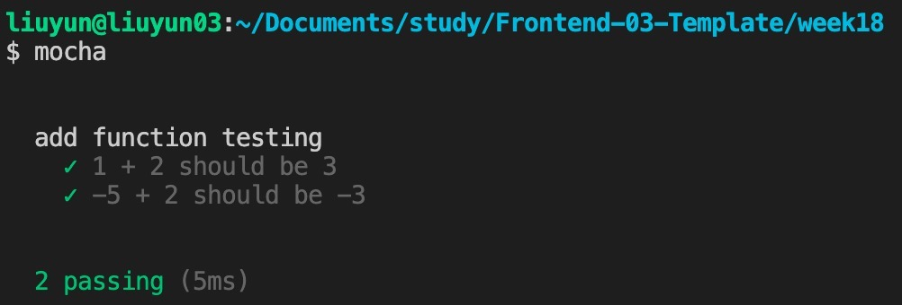
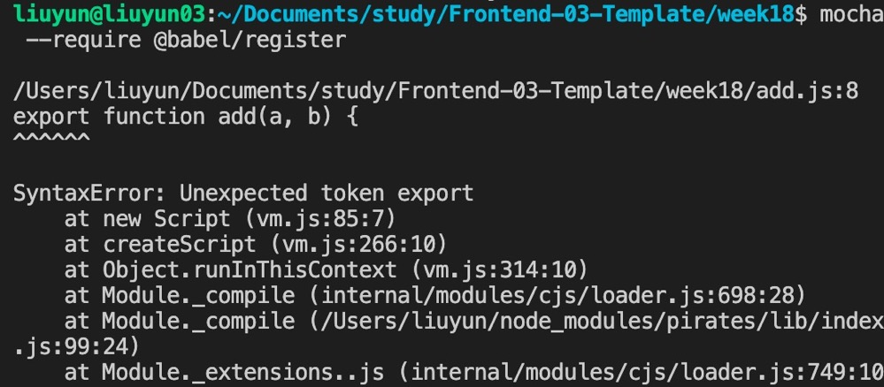
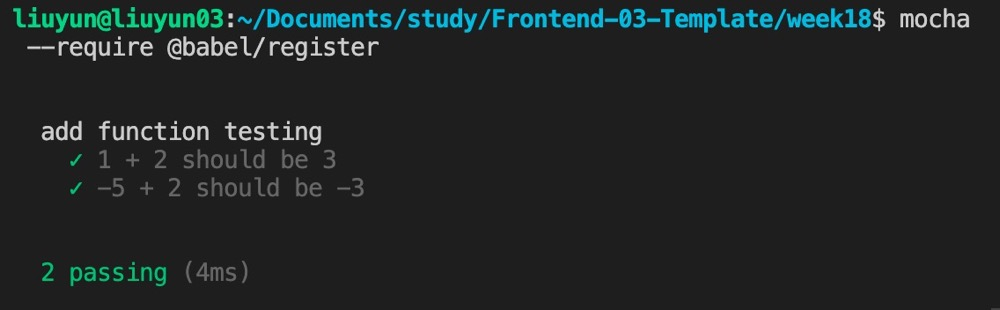
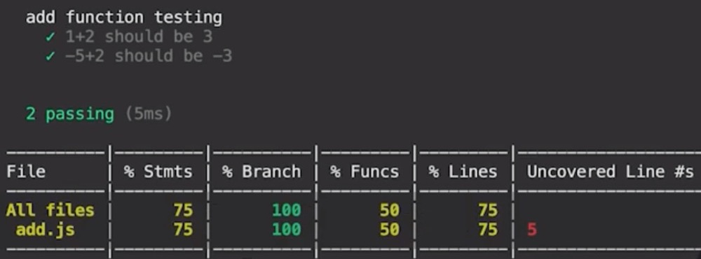
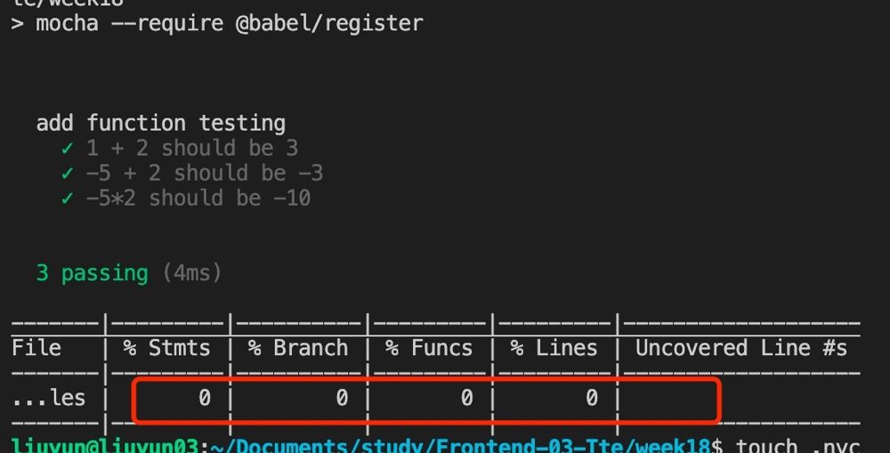

## mocha

```
// add.js
function add(a, b) {
  return a + b;
}

module.exports = add;

```

```
// add.test.js
var assert = require("assert");
var add = require("../add.js");

describe("add function testing", function () {
  it("1 + 2 should be 3", function () {
    assert.equal(add(1, 2), 3);
  });

  it("-5 + 2 should be -3", function () {
    assert.equal(add(-5, 2), -3);
  });
});
```



目前 add.js 必须以 module.exports 方式导出去，要解决的话，需要借助@babel/register(https://www.babeljs.cn/docs/babel-register):
① npm i -D @babel/core @babel/register
② mocha --require @babel/register



③ 此时还是裸写的 babel，没有规定转换成什么版本，需要配置.babelrc
④ add.test.js 文件中 require 引入方式改为 import 引入方式

```
var assert = require("assert");
// var add = require("../add.js");
import { add } from "../add.js";

describe("add function testing", function () {
  it("1 + 2 should be 3", function () {
    assert.equal(add(1, 2), 3);
  });

  it("-5 + 2 should be -3", function () {
    assert.equal(add(-5, 2), -3);
  });
});
```

⑤ 

⑥ 为了方便，在 package.json 中 scripts 里面配置 test 命令：

```
...
"scripts": {
    "test": "./node_modules/.bin/mocha --require @babel/register"
  }
...
```

## code coverage

单元测试里面有一个非常重要的指标，code coverage，这个 mocha 里面天然没有。想知道我们的 test case 写的全不全，需要借助于 code coverage，这个可以借助新的工具 nyc

1.  安装 nyc： npm i nyc -D
2.  nyc npm run test （前提把 add.js 中的 export 都要改成 module.exports，因为是非 babel 模式）
    
3.  然后在 add.js 里面加了一个乘法函数，再执行 nyc npm run test

```
function add(a, b) {
  return a + b;
}

function mul(a, b) {
  return a * b;
}

module.exports.add = add;
module.exports.mul = mul;
```

 4. 加上测试用例, 再跑一边测试就可以覆盖 100%

```
// add.test.js

...
 it("-5*2 should be -10", function () {
    assert.equal(mul(-5, 2), -10);
  });
...
```

5.  如果 add.js 直接改成 export 方式导出方法，执行 nyc npm run test 会不生效的

6.  需要安装插件：npm i -D babel-plugin-istanbul, 新建.nycrc 文件 (https://www.npmjs.com/package/@istanbuljs/nyc-config-babel)

```
//.babelrc 添加 plugins 配置
{
    "presets": ["@babel/preset-env"],
    "plugins": ["istanbul"]
}


// .nycrc 添加 extends 配置
{
    "extends": "@istanbuljs/nyc-config-babel"
}

```

7. npm run coverage 中间报了个错，原因是要升级 node 版本，尝试 node12 可以正常执行
8. 最后执行 npm run converage 成功
